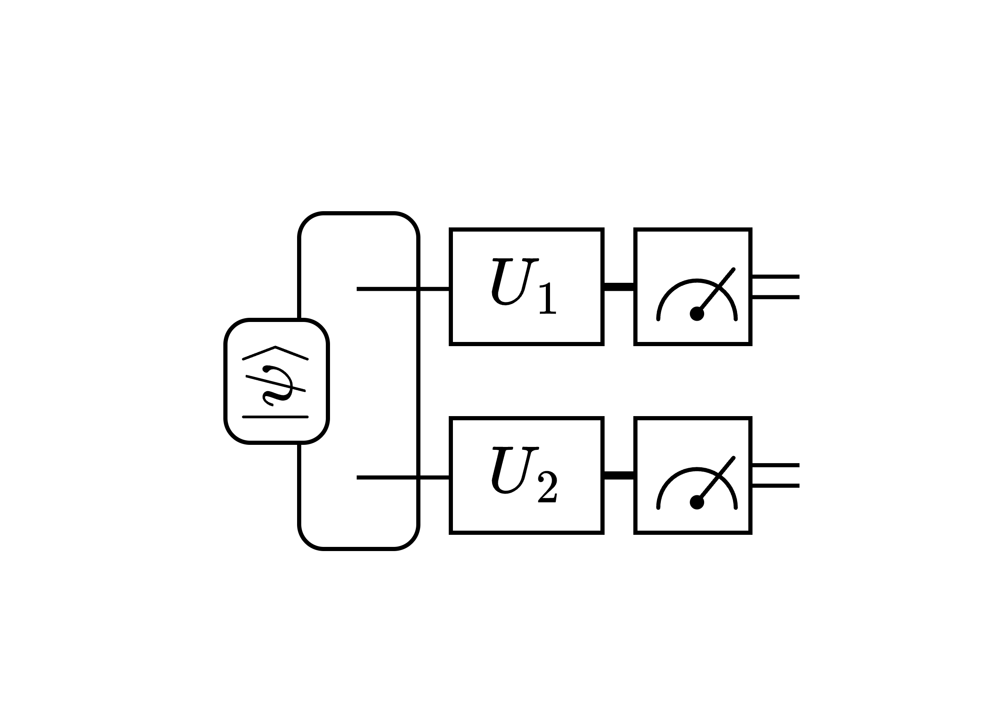
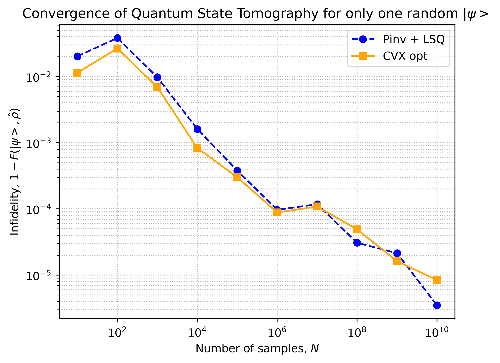
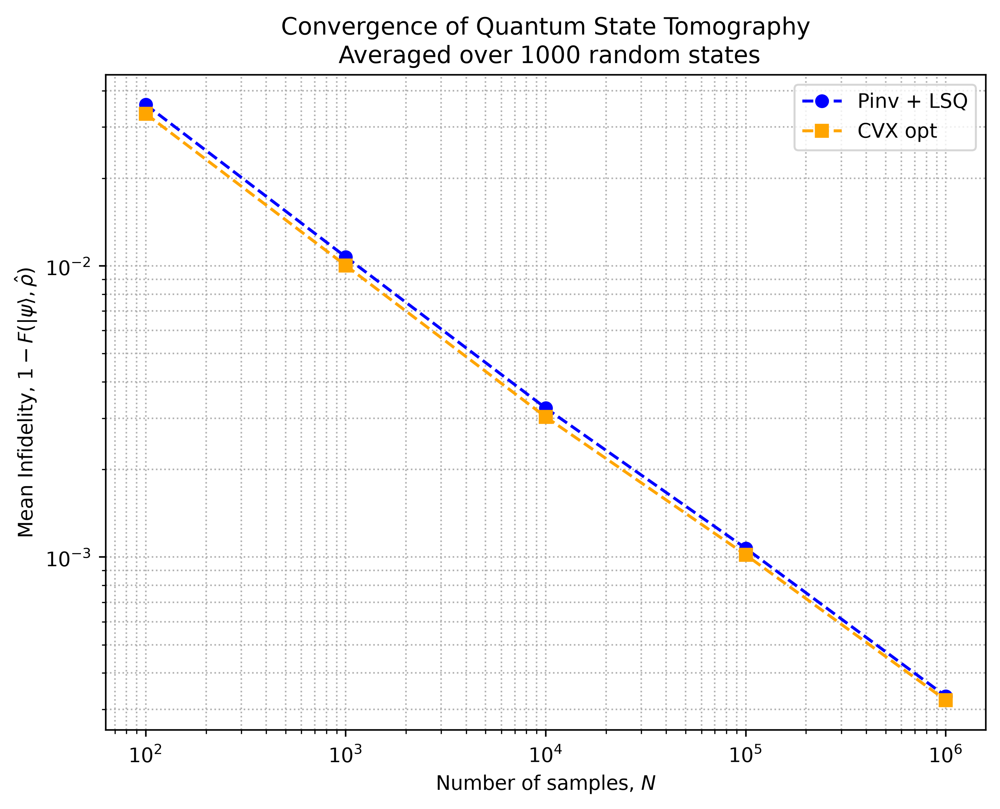
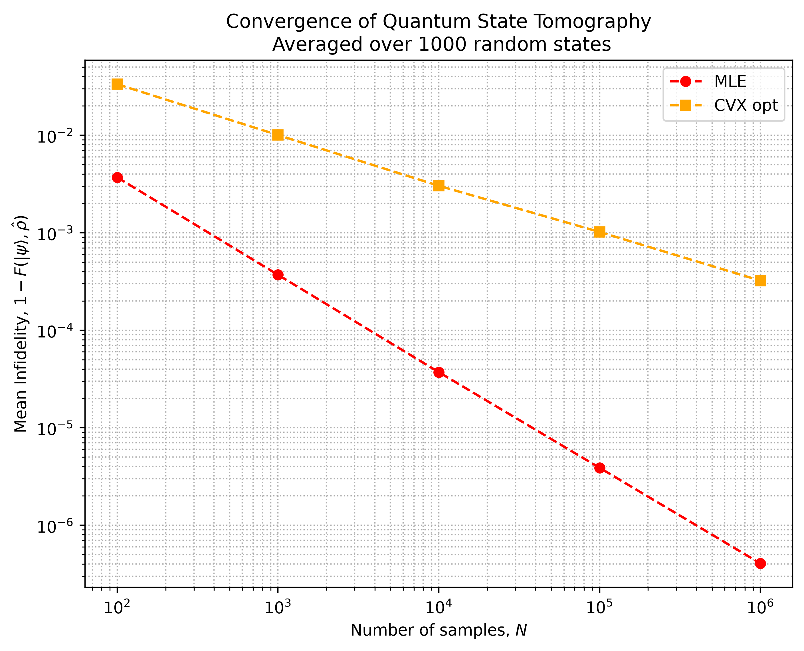

# Домашнее задание 1. Восстановление чистого состояния $\ket{\psi}$.

## Постановка задачи

Пусть у нас есть случайное чистое двухкубитное состояние $\ket{\psi}$. Мы хотим его восстановить, используя полученные результаты измерений состояния в разных базисах (на компьютере это делается через `np.random.multinomial`). 

Поворот базиса реализуется с помощью операторов $U_1, U_2$. Выбираются они из множества $\{\mathbb{I}, R_x(\pi/2), R_y(-\pi/2)\}$. Итого у нас будет $3^2 = 9$ схем измерений, а также $9 \times 4 = 36$ полученных частот (для каждой схемы и для каждой битовой строчки).

Таким образом, поставлена следующая задача

$$
\boldsymbol{f} = M^{\dagger} \text{vec}(\rho),
$$

где $\boldsymbol{f}$ - вектор частот, $M^{\dagger}$ - матрица, состоящая из векторизованных POVM-операторов для каждой схемы измерений для каждой исхода, $\text{vec}(\rho)$ - векторизованная матрица плотности. 

На лекции было разобрано три подхода:

1. Псевдоинверсия (pinv): просто находится матрица, обратная к $M^{\dagger}$. Минус: МП может быть не положительная.
2. Псевдоинверсия + МНК (pinv + lsq): улучшает МП после процедуры псевдоинверсии и делает ее СЗ положительными.
3. Выпуклая оптимизация (cvx opt): самая надежная процедура, которая сразу находит МП, подчиняющуюся нужным условиям (след = 1 и положительность).

После процедуры томографии мы получаем оценку матрицы плотности $\hat{\rho}$. Ее мы сравниваем с заданным путем расчета фиделити

$$
F = \bra{\psi} \hat{\rho} \ket{\psi} 
$$

В рамках задачи нужно было реализовать все три метода и сравнить их между собой: построить графики $1 - F$ от количества сэмплов.

## Результаты

Код программы написан в `tomo_calc.py`, а все визуализации и прочие расчеты в `results.ipynb`.

Необходимо было также посчитать число обуловленностей матрицы $M^{\dagger}$. Оно оказалось равно $3$.

Сначала я посчитал схему для одного случайного $\ket{\psi}$.

Также было проведено сравнение для среднего значения инфиделити для обоих методов, вычисленное на 1000 случайных $\ket{\psi}$.

 Здесь уже можно посчитать коэффициент наклона, полагая 

$$
1 - F \propto \frac{1}{N^q}.
$$

Получилось, что $q = 0.5$, то есть инфиделити убывает как $\displaystyle\frac{1}{\sqrt{N}}$.

# Домашнее задание 1.1 Восстановление чистого состояния $\ket{\psi}$ с помощью метода максимального правдоподобия (MLE).

На лекции мы получили следующую операторную задачу, которая вытекает из MLE

$$
\psi = \hat{J}(\psi) \psi,
$$

где 

$$
\hat{J}(\psi) = \frac{1}{n} \sum_{\alpha, i} \frac{k_i^{(\alpha)}}{p_i^{(\alpha)}}\ \hat{P_i}^{(\alpha)},
$$

где $N$ - число проведенных экспериментов, $k_i^{(\alpha)}$ - количество исходов для $i$-го результата в $\alpha$-ой схеме измерений, $\hat{P_i}^{(\alpha)}$ - проектор на $i$-ий результат в $\alpha$-ой схеме измерений и $p_i^{(\alpha)} =\bra{\psi} \hat{P_i}^{(\alpha)}\ket{\psi}$. 

Решение ищется методом последовательных приближений

$$
\psi^{(k+1)} = \mu \hat{J}(\psi^{(k)}) \psi^{(k)} + (1 - \mu) \psi^{(k)},\quad \mu \approx 0.5
$$

$$
\psi^{(k+1)} /= ||\psi^{(k+1)}||.
$$

Критерием остановки является условие

$$
1 - F = 1 - \left|\braket{\psi^{(k+1)}|\psi^{(k)}}\right|^2 < \varepsilon.
$$

Необходимо реализовать MLE и найти коэф. наклона графика инфиделити.

## Результаты

Была написана функция `mle_method` в `tomo_calc.py` принимающая на вход матрицу проекторов $M^{\dagger}$, вектор частот $\boldsymbol{f}$, начальное приближение $\rho_0$, а также параметры $\mu, \varepsilon$ и `max_iter`, которые изначально заданы как 

$$
\mu = 0.5,\quad \varepsilon=10^{-6},\quad \text{max iter} = 2000. 
$$

Начальное приближение было взято из решения методом выпуклой оптимизации (CVX opt). 

По итогу получили следующий график среднего значения инфиделити для обоих методов, вычисленное на 1000 случайных $\ket{\psi}$. 

Видно, что метод MLE разительно улучшает метод CVX, то есть решение полученное с помощью МНК. Коэффициент наклона $q$ получился равен $1$:

$$
1 - F_{MLE} \propto \frac{1}{N}
$$
